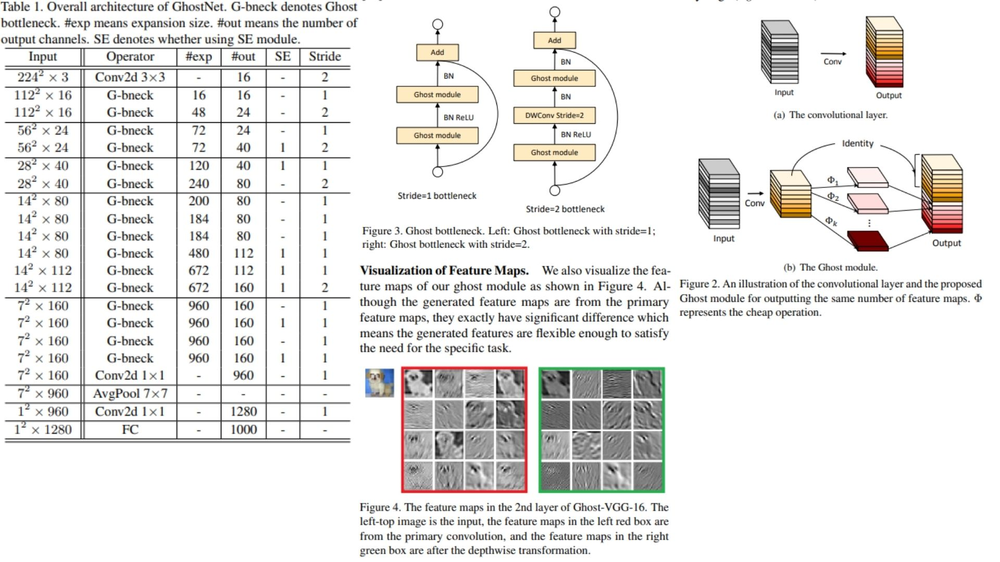

# 👻 GhostNet-Replication PyTorch Implementation

This repository contains a replication of **GhostNet**, based on the paper **“GhostNet: More Features from Cheap Operations”**, implemented in PyTorch. The model is designed for **efficient and lightweight image classification**, leveraging **Ghost modules** and **optional Squeeze-and-Excitation (SE) blocks**.

- Implemented **GhostNet** using **modular GhostBottleneck units**, where each bottleneck contains **two Ghost modules** (expansion + projection), **depthwise convolution for stride=2**, and **optional SE blocks**.

- Architecture:  
**Stem → GhostBottleneck Blocks → Conv1x1 → AdaptiveAvgPool → Conv1x1 → FC**

> **Note on Ghost modules:** Ghost modules generate more feature maps from cheap operations, maintaining efficiency while preserving accuracy. Our implementation strictly follows the paper.

**Paper reference:** [GhostNet: More Features from Cheap Operations](https://arxiv.org/abs/1911.11907) 🧠

## 🖼 Overview – GhostNet Architecture

  

**Figure 2 – Ghost Module:**  
- Applies a small convolution (e.g., 1×1) to generate intrinsic feature maps  
- Uses cheap linear operations (e.g., depthwise conv) to generate additional “ghost” feature maps  
- Concatenates intrinsic + ghost feature maps to form the full output  
- Reduces computational cost while maintaining expressive power  

**Figure 3 – Ghost Bottleneck:**  
- Two Ghost Modules stacked: expand → project  
- **Stride = 1:** standard residual shortcut  
- **Stride = 2 (downsampling):** depthwise 3×3 conv inserted between Ghost Modules, shortcut downsampled to match spatial & channel dimensions  

**Figure 4 – Macro Architecture of GhostNet:**  
- 3×3 Conv stem layer  
- Sequence of Ghost Bottleneck blocks grouped by feature-map resolution (stages)  
- Global Average Pooling  
- 1×1 Conv projecting to 1280-dim vector  
- Final fully-connected layer for classification
  
## 📋 Model Parameters – Table 1

Refer to **Table 1** in `images/figmix.jpg` for detailed configuration:  

| Stage / Input Size | Operator / Block | #exp | #out | SE? | Stride |
|--------------------|-----------------|------|------|-----|--------|
| 224² × 3           | 3×3 Conv         | –    | 16   | –   | 2      |
| 112² × 16          | GhostBottleneck  | 16   | 16   | 0   | 1      |
| 112² × 16          | GhostBottleneck  | 48   | 24   | 0   | 2      |
| 56² × 24           | GhostBottleneck  | 72   | 24   | 0   | 1      |
| 56² × 24           | GhostBottleneck  | 72   | 40   | 1   | 2      |
| 28² × 40           | GhostBottleneck  | 120  | 40   | 1   | 1      |
| 28² × 40           | GhostBottleneck  | 240  | 80   | 0   | 2      |
| 14² × 80           | GhostBottleneck  | 200  | 80   | 0   | 1      |
| 14² × 80           | GhostBottleneck  | 184  | 80   | 0   | 1      |
| 14² × 80           | GhostBottleneck  | 184  | 80   | 0   | 1      |
| 14² × 80           | GhostBottleneck  | 480  | 112  | 1   | 1      |
| 14² × 112          | GhostBottleneck  | 672  | 112  | 1   | 1      |
| 14² × 112          | GhostBottleneck  | 672  | 160  | 1   | 2      |
| 7² × 160           | GhostBottleneck  | 960  | 160  | 0   | 1      |
| 7² × 160           | GhostBottleneck  | 960  | 160  | 1   | 1      |
| 7² × 160           | GhostBottleneck  | 960  | 160  | 0   | 1      |
| 7² × 160           | GhostBottleneck  | 960  | 160  | 1   | 1      |
| 7² × 160           | 1×1 Conv         | –    | 960  | –   | 1      |
| 7² × 960           | Global AvgPool   | –    | –    | –   | –      |
| 1² × 960           | 1×1 Conv         | –    | 1280 | –   | 1      |
| –                  | FC (num_classes) | –    | 1000 | –   | –      |

> GhostNet achieves high efficiency by generating “ghost” feature maps via cheap operations. SE blocks add channel-wise attention, depthwise conv reduces FLOPs, and repeated GhostBottlenecks preserve expressive power without significantly increasing model size.

---

## 🏗 Project Structure

```bash
GhostNet/
│
├── src/
│   ├── layers/
│   │   ├── conv_layer.py             # Standard conv layer (primary conv)
│   │   ├── ghost_module.py           # Ghost Module implementation
│   │   ├── flatten_layer.py          # Flatten layer
│   │   ├── fc_layer.py               # Fully connected layer
│   │   ├── pool_layers/
│   │   │   ├── maxpool_layer.py      # MaxPool
│   │   │   └── avgpool_layer.py      # AdaptiveAvgPool
│   │
│   ├── blocks/
│   │   └── ghost_bottleneck.py       # GhostBottleneck unit (Ghost modules + depthwise conv + SE)
│   │
│   ├── model/
│   │   └── ghostnet.py               # Full GhostNet model (Stem + Bottleneck blocks)
│   │
│   └── config.py                      # Input size, num_classes, expansion ratios
│
├── images/
│   └── figmix.jpg                     # Figures 2–4 and Table 1 from the paper
│
├── requirements.txt
└── README.md
```
---

## 🔗 Feedback

For questions or feedback, contact: [barkin.adiguzel@gmail.com](mailto:barkin.adiguzel@gmail.com)
